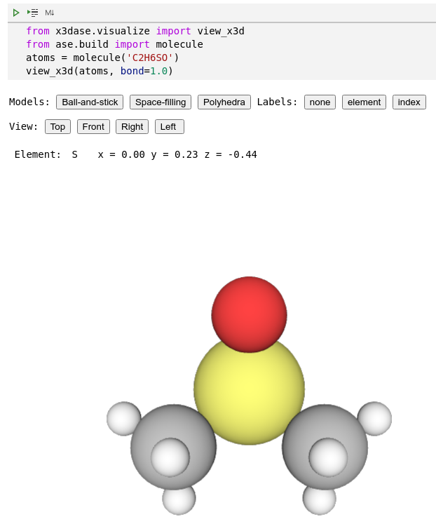
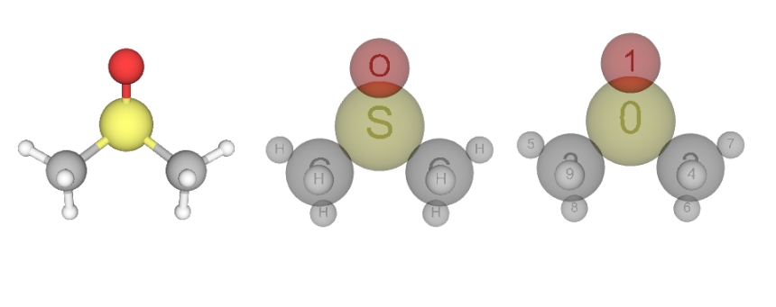
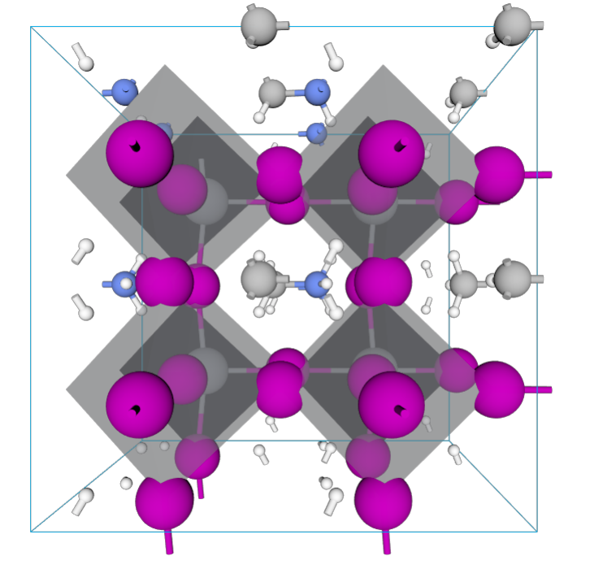

# x3dase

Python module for drawing and rendering atoms and molecules objects using X3DOM. X3dase can be used as a viewer for the molecule structure in the Jupyter notebook.

Functions:
* Support all file-formats using by ASE, including cif, xyz, cube, pdb, json, VASP-out and so on.
* Ball & stick
* Space filling
* Polyhedral
* Isosurface
* Show element and index
* Measure distance and angle

For the introduction of ASE , please visit https://wiki.fysik.dtu.dk/ase/index.html


## Author
* Xing Wang  <xingwang1991@gmail.com>

## Dependencies

* Python
* ASE
* Skimage
## Installation using pip
```sh
pip install --upgrade --user xespresso
```
## Installation from source
You can get the source using git:
``` sh
git clone https://github.com/superstar54/xespresso.git
```
Then add it to your PYTHONPATH and PATH. On windows, you can edit the system environment variables.

``` sh
export PYTHONPATH=/path-to-x3dase:$PYTHONPATH
```

## Examples

### Draw molecule in Jupyter notebooks



### Shortcut
|key | function|
|-|-|
|b| ball-and-stick model|
|s| spacefilling model|
|p| polyhedra model|
|1| view top|
|2| view front|
|3| view right|
|4| view element|
|5| view index|

### Show different models


### Measure distance and angle between atoms
Using Ctrl + click to select atoms.
|Selection | measurement |
|-|-|
| single atom | xyz position and atomic symbol |
| two atoms | interatomic distance |
| three atoms | three internal angles |


### Polyhedra for crystal



### Isosurface for electron density

