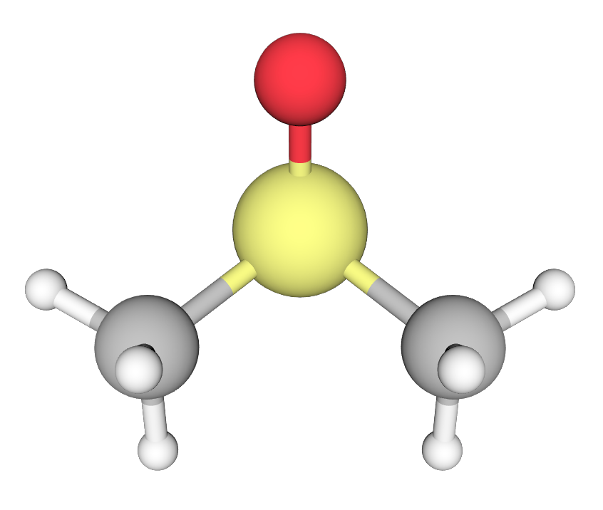

# x3dase
X3D for  Atomic Simulation Environment 


Python module for drawing and rendering ASE (Atomic Simulation Environment) atoms and molecules objects using X3DOM.

For the introduction of ASE , please visit https://wiki.fysik.dtu.dk/ase/index.html

* Support all file-formats using by ASE, including cif, xyz, cube, pdb, json, VASP-out and so on.
* Ball & stick
* Polyhedral


### Author
* Xing Wang  <xingwang1991@gmail.com>

### Dependencies

* Python
* ASE
* Skimage

### Installation

Clone this repo. Add it to your PYTHONPATH and PATH. On windows, you can edit the system environment variables.

``` sh
export PYTHONPATH=/path-to-x3dase:$PYTHONPATH
```

### Examples

#### Draw molecule with bonds

A example of C<sub>2</sub>H<sub>6</sub>SO molecule. See examples/c2h6so.py

``` python
from ase.build import molecule
from x3dase.x3d import X3D

atoms = molecule('C2H6SO')
X3D(atoms).write('c2h6so.html')
````


